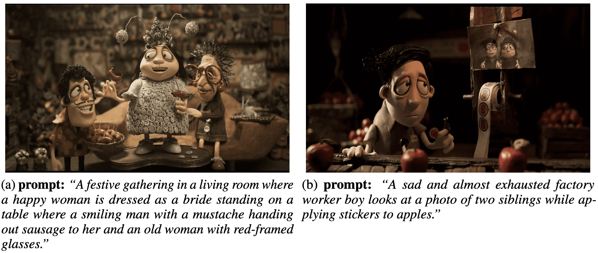

# Fine-Tuning Stable Diffusion for Stop-Motion Style Synthesis from Text Prompts

## Overview
This project presents a complete pipeline for fine-tuning the Stable Diffusion XL (SDXL) model to generate images in the unique stop-motion animation style, inspired by the film Memoir of a Snail. The pipeline covers custom dataset creation, environment setup using Singularity for scalable and reproducible multi-GPU training, LoRA-based efficient fine-tuning, and user-friendly deployment with a Gradio web app. Evaluation uses both semantic (CLIP Score) and perceptual (LPIPS) metrics, and the project achieves state-of-the-art prompt alignment and visual fidelity for stylized stop-motion image synthesis.

## Features
- **Custom Dataset:** 1000+ hand-labeled image-prompt pairs in stop-motion style, covering diverse scenes and emotions.
- **Scalable Training:** Singularity container supports distributed, multi-GPU fine-tuning with PyTorch and Hugging Face diffusers.
- **Efficient Fine-Tuning:** Uses Low-Rank Adaptation (LoRA) to minimize trainable parameters while maximizing style transfer and prompt alignment.
- **Interactive Demo:** Gradio web app with prompt engineering via LLM, user-adjustable parameters (steps, guidance scale, noise fraction), and high-res output.
- **Reproducible Workflows:** All training and inference steps are fully containerized and compatible with SLURM HPC clusters.

## Dataset
- Curated from the film Memoir of a Snail (2025), frames sampled every ~5 seconds and labeled with neutral, descriptive prompts.
- Format: Hugging Face parquet format


## Installation
```bash
# Clone the repository
git clone https://github.com/your-username/stopmotion-sdxl.git
cd stopmotion-sdxl

# Build the Singularity Container
module load singularity/3.9.7
singularity build --fakeroot diffusers.sif diffusers.def
```
## Training
```bash
# Single-GPU (local)
python train_text_to_image_lora_sdxl.py \
  --pretrained_model_name_or_path="stabilityai/stable-diffusion-xl-base-1.0" \
  --pretrained_vae_model_name_or_path="madebyollin/sdxl-vae-fp16-fix" \
  --dataset_name="path/to/your/dataset" \
  --output_dir="output" \
  --resolution=1024 \
  --train_batch_size=1 \
  --num_train_epochs=250 \
  --checkpointing_steps=250 \
  --gradient_accumulation_steps=4 \
  --learning_rate=1e-4 \
  --train_text_encoder \
  --report_to="wandb"

# Multi-GPU (recommended; SLURM + Singularity)
sbatch job_diffusers.sh
```
## Dataset
- Output for the prompt ***'A clown performing magic tricks for a large audience.'***


## Acknowledgment
This research is supported by the Arkansas High Performance Computing Center and funded through multiple National Science Foundation grants and the Arkansas Economic Development Commission.
